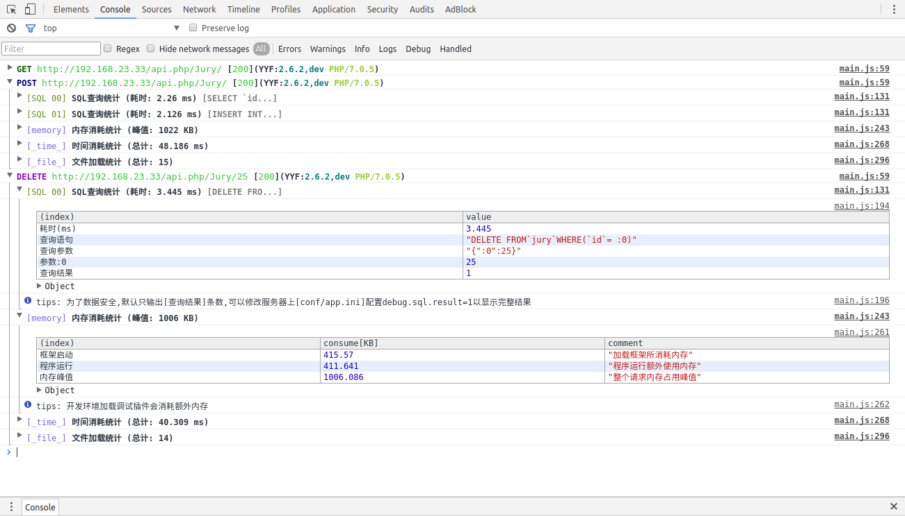
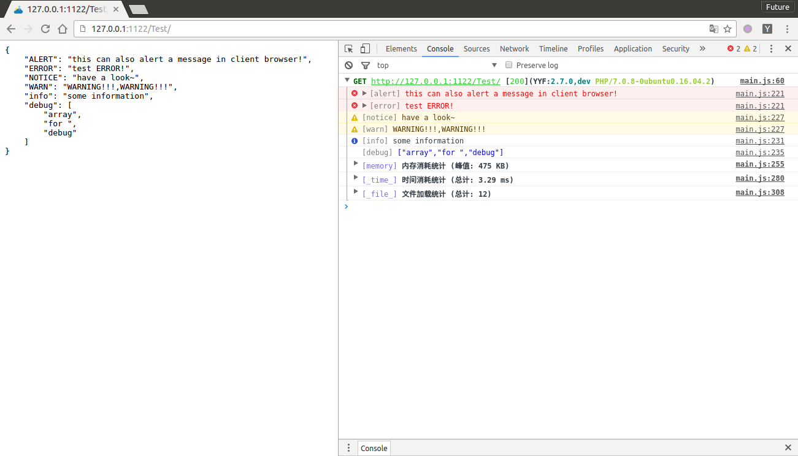
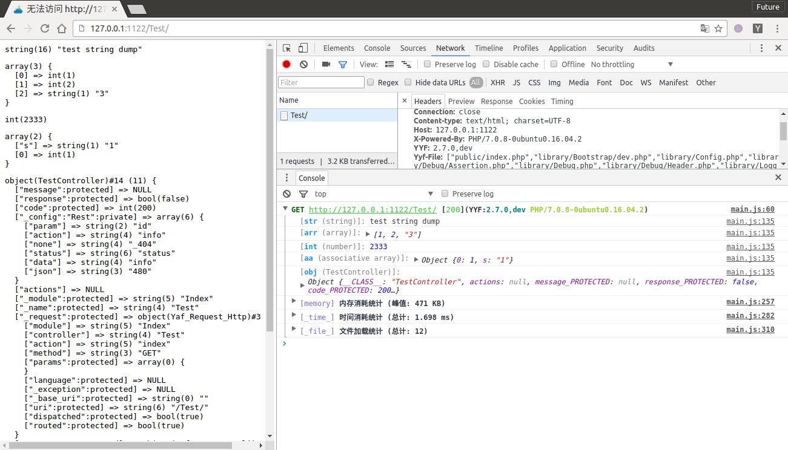

YYF Debugger
===============
YYF 浏览器调试工具
------------------
在浏览器console显示YYF调试信息，不影响浏览器的正常输出.

效果截图
-----
如图在浏览器中显示调试信息


安装（一分钟）
------

### 方法一：安装已经打包的扩展 (推荐)
1. 在[realease页](https://github.com/NewFuture/YYF-Debugger/releases/)下载最新扩展 [YYF-Debugger-*.crx](https://github.com/NewFuture/YYF-Debugger/releases/download/v1.1.22/YYF-Debugger-1.1.22.crx)
2. 打开chrome扩展页面[chrome://extensions/](chrome://extensions/)
3. 将下载文件拖拽到[chrome://extensions/](chrome://extensions/),选择安装即可

### 方法二：从源码安装

1. 下载解压源码
2. 打开扩展页面[chrome://extensions/](chrome://extensions/)
3. 勾选`开发者模式`
4. 加载已解压的扩展程序
5. 选中对应的文件夹即可

### 安装完成
1. 打开[http://yyf.yunyin.org](http://yyf.yunyin.org)
2. 点击扩展按钮激活(debugging)
3. 打开控制台(`F12`),刷新(`F5`)
4. 看到和截图一样的输出则完成安装

### 主要功能
* tracer信息记录[如效果图]
* SQL查询显示 
* 显示服务器日志 
```php
//服务器中执行代码如下
//开发模式默认会自动监听系统日志
Logger::alert($logger['ALERT']);
Logger::error($logger['ERROR']);
Logger::notice($logger['NOTICE']);
Logger::warn($logger['WARN']);
Logger::info($logger['info']);
Logger::debug($logger['debug']);
```
* dump数据
```php
//header中dump，不影响页面输出
 Debug::header()
  ->str('test string dump')
  ->arr([1,2,'3'])
  ->int(2333)
  ->aa(['s'=>'1',1])
  ->obj($this);
  //dump到浏览器
  Debug::dump('test string dump');
  Debug::dump([1,2,'3']);
  Debug::dump(2333);
  Debug::dump(['s'=>'1',1]);
  Debug::dump($this);
```
