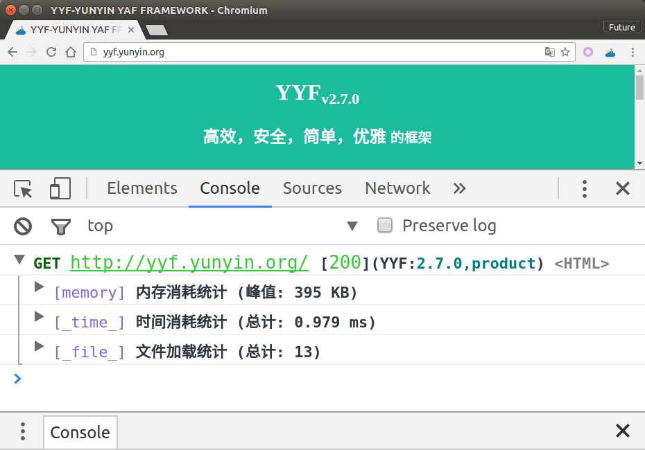
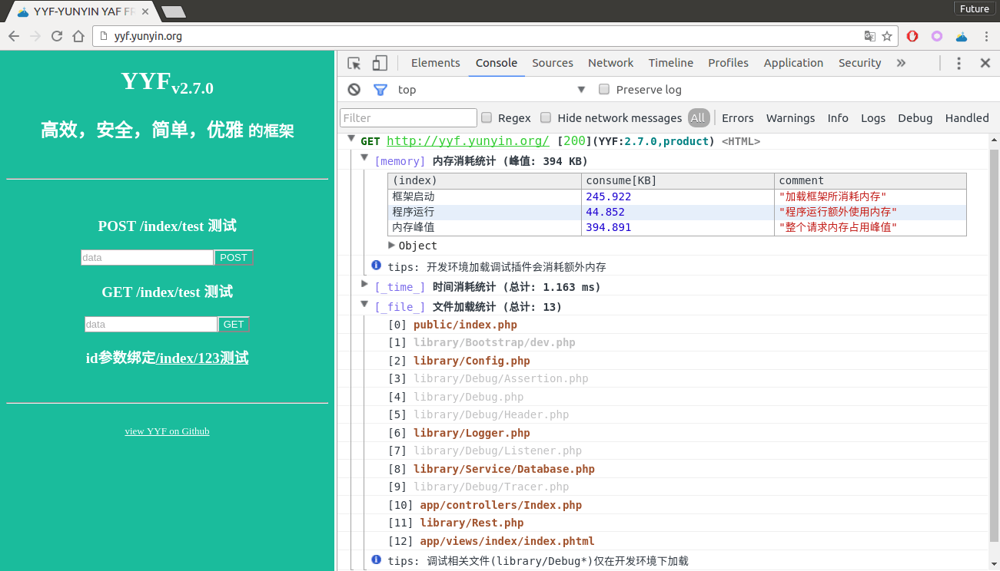
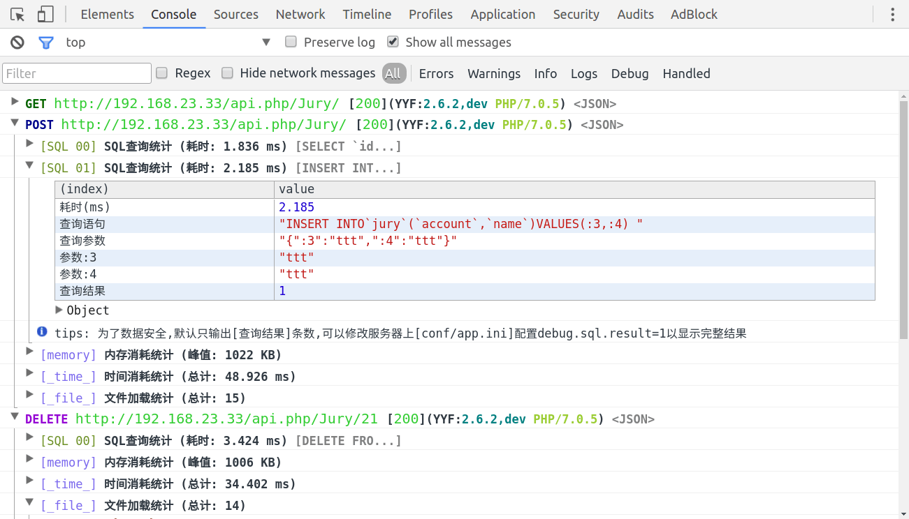

# YYF Debugger

## YYF 浏览器调试工具

在浏览器console显示[YYF](https://github.com/YunYinORG/YYF)调试信息，不影响浏览器的正常输出.

## 效果截图

如图在浏览器中显示调试信息 

## 安装（一分钟）

### 方法一：从源码安装(推荐)

1. 下载解压[源码](https://github.com/NewFuture/YYF-Debugger/archive/master.zip),或者`git clone https://github.com/NewFuture/YYF-Debugger.git`
2. 打开扩展页面<chrome://extensions/>,然后勾选`开发者模式`
3. 加载已解压的扩展程序,选中解压后的文件夹(包含'manifest.json'的文件夹)

### 方法二：安装已经打包的扩展

1. 在[realease页](https://github.com/NewFuture/YYF-Debugger/releases/) 下载最新扩展 `YYF-Debugger-*.crx`
2. 打开chrome扩展页面<chrome://extensions/>
3. 将下载文件拖拽到<chrome://extensions/>,选择安装即可

### 安装完成(验证)

1. 打开<http://yyf.yunyin.org>, 然后 打开控制台(`F12`)
2. 刷新(`F5`) 看到如效果图一致的效果说明安装完成

### 主要功能

- 点击图标可开启或者关闭插件(默认已对`localhost`,`yyf.yunyin.org`和`192.168.23.33`等开启)
- tracer信息记录(可以展开) 
- SQL查询显示(默认自动输出sql查询) 
- 显示服务器日志(日志级别>=`alert`会在浏览器弹窗) 

  ```php
  //服务器中执行代码如下
  $logger=[
    'ALERT'=>'this can also alert a message in client browser!',
    'ERROR'=>'test ERROR!',
    'NOTICE'=>'have a look~',
    "WARN"=>'WARNING!!!,WARNING!!!',
    'info'=>'some information',
    'debug'=>['array','for ','debug'],
  ];
  //开发模式默认会自动监听系统日志
  Logger::alert($logger['ALERT']);
  Logger::error($logger['ERROR']);
  Logger::notice($logger['NOTICE']);
  Logger::warn($logger['WARN']);
  Logger::info($logger['info']);
  Logger::debug($logger['debug']);
  ```

- dump数据(通过header输出数据，而影响页面输出类容) 

  ```php
  //header中dump，不影响页面输出
  Debug::header()
  ->str('test string dump')
  ->arr([1,2,'3'])
  ->int(2333)
  ->aa(['s'=>'1',1])
  ->obj($this);
  //dump到浏览器
  Debug::dump('test string dump');
  Debug::dump([1,2,'3']);
  Debug::dump(2333);
  Debug::dump(['s'=>'1',1]);
  Debug::dump($this);
  ```
